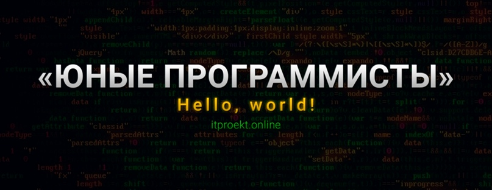
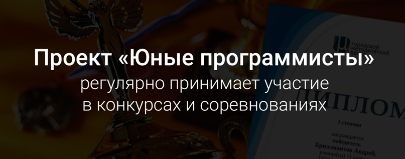

# **Люди Дела**

#### **«Юные программисты»**

Дополнительные общеразвивающие программы «Хочу быть программистом» и «Инфомир»
«Хочу быть программистом» — это школа программирования, в которой дети от 11 до 17 лет:

- учатся создавать игры, сайты, приложения и мультфильмы;
- узнают, как работать с видео и создавать дизайн (Photoshop, Illustrator, Adobe Premier, After Effects, Blender и т.п.);
- развивают предпринимательские навыки и генерируют бизнес-идеи;
- учатся творчески решать проблемы на курсах «Дизайн-мышление» и «Фузионизм»;
- изучают английский язык в процессе программирования;
- прокачивают компьютерную грамотность и узнают о безопасности в сети;
… и многое-многое другое! 

#### **Наши занятия проходят:**
- по будням после уроков, по выходным дням, в субботу или на базе МИФИ;
- в офисах ИТ-компаний, чтобы дети уже во время обучения погружались в правильную атмосферу. 

#### *Мы готовим детей к поступлению в ведущие вузы, созданию бизнеса, работе в российских или международных технологических компаниях. Через программирование мы учим их думать самостоятельно и раскрывать свой потенциал.*

Во время обучения - просто необходимо участвовать в конкурсах и различных мероприятиях. Подготовка к соревнованиям - улучшает закрепление изученных материалов, а также придаёт уверенности в себе. 

#### **Если Вы хотите, чтобы Ваш ребенок углубленно изучал:**
- Создание сайтов
- Дизайн-мышление
- Создание мобильных приложений
- Музыкальное программирование
- Flash-программирование

**Добро пожаловать в проект "Юные программисты"!**
